# 🤖 Multi-Agent Test Generator

**Sistema intelligente per la generazione automatica di test Python con garanzia di copertura tramite AI generativa e validazione formale.**

[](https://www.python.org)
[](https://github.com/langchain-ai/langgraph)
[](https://ai.google.dev/)
[](https://coverage.readthedocs.io/)
[](LICENSE)

---

## 📖 Table of Contents

- [Overview](#-overview)
- [Features](#-features)
- [Prerequisites](#-prerequisites)
- [Installation](#-installation)
- [Quick Start](#-quick-start)
- [Demo Results](#-demo-results)
- [Architecture](#-architecture)
- [Project Structure](#-project-structure)
- [How It Works](#-how-it-works)
- [Configuration](#-configuration)
- [Programmatic Usage](#-programmatic-usage)
- [Testing](#-testing)
- [Development](#-development)
- [FAQ](#-faq)
- [Troubleshooting](#-troubleshooting)
- [Performance Tuning](#-performance-tuning)
- [Roadmap](#-roadmap)
- [License](#-license)
- [Credits](#-credits)

---

## ✨ Overview

Progetto accademico per il corso di **Ingegneria dei Linguaggi di Programmazione** che implementa un sistema multi-agente basato su LangGraph per generare automaticamente test unitari pytest con garanzia di **branch coverage ≥80%**.

Il sistema combina tre pilastri fondamentali:

1. **🔍 Analisi Statica Formale** - Parser Lark personalizzato per validazione grammaticale rigorosa
2. **🧠 Generazione Intelligente** - Google Gemini 2.5 Flash per creazione test contestuale
3. **📊 Validazione Rigorosa** - Coverage.py (standard industry) per misurazione affidabile

---

## 🎯 Features

### ✅ Validazione Grammaticale Rigorosa

Parser **Lark** personalizzato che garantisce conformità al subset Python definito in [`python_subset.lark`](test_generator/python_subset.lark):

**Costrutti Supportati**:
- ✅ Definizioni funzione (`def`)
- ✅ Controllo di flusso: `if`/`else` (annidati, no `elif`)
- ✅ Operatori aritmetici: `+`, `-`, `*`, `/`
- ✅ Operatori di comparazione: `==`, `!=`, `<`, `>`, `<=`, `>=`
- ✅ Assegnamenti e `return`
- ✅ Commenti (`#`)

**Non Supportati**:
- ❌ Classi, decoratori, list comprehensions
- ❌ Loop (`for`, `while`) - roadmap futura
- ❌ `elif` - roadmap futura

### 🧠 Generazione Test AI-Powered

- **LLM**: Google Gemini 2.5 Flash via LangChain
- **Strategy**: Generazione mirata basata su branch map AST
- **Quality**: Spesso raggiunge 100% coverage al primo tentativo per funzioni semplici
- **Resilience**: Retry logic automatico per transient failures (tenacity)

### 📊 Coverage Garantita

- **Target**: 80% branch coverage (configurabile)
- **Tool**: `coverage.py` + `pytest-cov` (standard industry)
- **Loop**: Max 5 iterazioni di ottimizzazione (configurabile)
- **Verification**: Report JSON parsabile e verificabile manualmente

### 🏗️ Architettura Multi-Agente

Pattern **StateGraph** (LangGraph) con agenti specializzati:

| Agente | Responsabilità |
|--------|----------------|
| **CodeAnalyzerAgent** | Validazione Lark + estrazione branch (AST) |
| **UnitTestGeneratorAgent** | Generazione test iniziali via LLM |
| **CoverageOptimizerAgent** | Ottimizzazione iterativa per branch non coperti |
| **CoverageCalculator** | Esecuzione pytest e calcolo coverage |

---

## 📋 Prerequisites

### Software Requirements

- **Python**: 3.10 o superiore (testato fino a 3.13)
- **pip**: Package manager Python (incluso con Python)
- **Git**: Per clonare il repository (opzionale)

### API Key

- **Google Gemini API Key**: Richiesta per generazione test
  - Registrati gratuitamente su [Google AI Studio](https://ai.google.dev/)
  - Limite free tier: 60 richieste/minuto (sufficiente per tutte le demo)

### Sistema Operativo

- ✅ Windows (testato)
- ✅ Linux/Mac (compatibile)

---

## 💻 Installation

### Metodo 1: Via requirements.txt (Raccomandato)

Per **development** o **usage** con versioni pinned (massima riproducibilità):

```bash
# Clone repository (o scarica ZIP)
git clone <repository-url>
cd test_generator

# Crea virtual environment (raccomandato)
python -m venv venv

# Attiva virtual environment
# Windows PowerShell:
venv\Scripts\Activate.ps1
# Windows CMD:
venv\Scripts\activate.bat
# Linux/Mac:
source venv/bin/activate

# Installa dipendenze
pip install -r requirements.txt
```

### Metodo 2: Via setup.py

Per **installazione come package** nel tuo ambiente:

```bash
# Installazione normale
pip install .

# Installazione editable (development mode)
pip install -e .

# Con dipendenze development (black, flake8, mypy)
pip install -e ".[dev]"
```

### Verifica Installazione

```bash
# Verifica import
python -c "from test_generator import LangGraphOrchestrator; print('✅ Installation OK')"

# Verifica dipendenze critiche
python -c "import langchain, langgraph, lark, pytest; print('✅ Dependencies OK')"
```

---

## 🚀 Quick Start

### 1. Configura API Key

```bash
# Windows PowerShell
$env:GOOGLE_API_KEY = "your-api-key-here"

# Linux/Mac
export GOOGLE_API_KEY="your-api-key-here"

# Oppure crea file .env (aggiungi .env a .gitignore!)
echo "GOOGLE_API_KEY=your-api-key-here" > .env
```

### 2. Esegui Demo

**Launcher Unificato** (consigliato):

```bash
python run_demos.py
```

Menu interattivo per scegliere quale demo eseguire:

```
=======================================================================
MULTI-AGENT TEST GENERATOR - DEMO LAUNCHER
=======================================================================

Demo disponibili:
  1. Simple Demo    - Funzione base con branch (add)
  2. Auth Demo      - Logica condizionale (password/login)
  3. Calculator     - Menu aritmetico completo (5 funzioni)
  4. Complex Demo   - Sistema bancario estremo (80+ branch)
  0. Esci
-----------------------------------------------------------------------

Scegli demo (1-4, 0 per uscire):
```

**Esecuzione Demo Singole**:

```bash
python demos/demo_simple.py      # Demo 1 - Simple
python demos/demo_auth.py        # Demo 2 - Auth
python demos/demo_calculator.py  # Demo 3 - Calculator
python demos/demo_complex.py     # Demo 4 - Complex
```

### 3. Verifica Output

I test generati vengono salvati in `output/`:

```bash
output/
├── test_simple.py              # Test per demo 1
├── test_auth.py                # Test per demo 2
├── test_calculator.py          # Test per demo 3
└── test_extreme_banking.py     # Test per demo 4
```

**Verifica manuale coverage**:

```bash
cd output
pytest test_simple.py --cov=code_to_test --cov-branch --cov-report=term -v
```

Vedrai **gli stessi numeri** riportati dal sistema! ✅

---

## 📊 Demo Results

Tutte le demo raggiungono **≥80% Branch Coverage** (spesso 100%):

| Demo | Funzioni | Branch | Test Generati | Coverage | Tempo | Iterazioni |
|------|----------|--------|---------------|----------|-------|------------|
| 🟢 **Simple** | 1 | 2 | 3 | 100% | ~5s | 0 |
| 🟢 **Auth** | 2 | 4 | 7 | 100% | ~8s | 0 |
| 🟢 **Calculator** | 5 | 9 | 11 | 100% | ~12s | 0-1 |
| 🟡 **Complex** | 3 | 80+ | 50+ | 95-100% | ~30s | 2-4 |

**Note**:
- Gemini 2.5 Flash raggiunge spesso **100% coverage al primo tentativo** per funzioni semplici
- Demo Complex richiede ottimizzazione iterativa per branch edge-case complessi
- Tempi includono: validazione Lark (< 1s), generazione LLM (2-5s/iterazione), esecuzione pytest (1-3s)

---

## 🏗️ Architecture

### System Overview

```mermaid
graph TB
    A[User Code] --> B[CodeAnalyzerAgent]
    B -->|Branch Map| C[UnitTestGeneratorAgent]
    C -->|Initial Tests| D[CoverageCalculator]
    D -->|Coverage Report| E{Coverage ≥ 80%?}
    E -->|Yes| F[Success ✅]
    E -->|No| G{Iterations < 5?}
    G -->|Yes| H[CoverageOptimizerAgent]
    H -->|Additional Tests| D
    G -->|No| I[Partial Success ⚠️]
    
    style B fill:#e1f5ff
    style C fill:#fff4e1
    style H fill:#fff4e1
    style D fill:#f0f0f0
    style F fill:#d4edda
    style I fill:#fff3cd
```



### State Machine Flow (LangGraph)

Il workflow è implementato come **StateGraph** con i seguenti nodi:

1. **`analyze`** → Validazione Lark + estrazione branch (AST)
2. **`generate`** → Generazione test iniziali (LLM)
3. **`measure`** → Esecuzione pytest e calcolo coverage
4. **Decision** → `optimize` (se coverage < target) OR `end`
5. **`optimize`** → Generazione test aggiuntivi per branch scoperti
6. **Loop** → Torna a `measure` (max 5 iterazioni)

### Component Deep Dive

#### 📁 Core Modules

```
test_generator/
├── orchestrator.py           # LangGraph StateGraph coordinator
│   └── LangGraphOrchestrator  # Main workflow orchestrator
├── agents.py                  # Specialized agents
│   ├── CodeAnalyzerAgent      # Lark validation + AST analysis
│   ├── UnitTestGeneratorAgent # Initial test generation
│   └── CoverageOptimizerAgent # Iterative optimization
├── coverage_calculator.py     # pytest + coverage.py integration
│   └── CoverageCalculator     # Test execution and metrics
├── code_analysis.py           # AST-based branch detection
│   └── CodeAnalyzer           # Function/branch extraction
├── llm_client.py              # LLM abstraction layer
│   ├── BaseLLMClient (ABC)    # Abstract interface
│   └── LangChainLLMClient     # Google Gemini implementation
├── models.py                  # Pydantic data models
│   ├── BranchMap              # Analysis result
│   ├── CoverageResult         # Coverage metrics
│   └── AgentState             # LangGraph state
├── prompts.py                 # LLM system prompts
├── config.py                  # Configuration
└── python_subset.lark         # Formal grammar definition
```

#### 🔄 Data Flow

```
Source Code (str)
    ↓
CodeAnalyzerAgent → BranchMap (Pydantic)
    ↓                   ↓
    ↓           [functions: List[FunctionInfo]]
    ↓           [total_branches: int]
    ↓
UnitTestGeneratorAgent → Test Code (str)
    ↓
CoverageCalculator → CoverageResult (Pydantic)
    ↓                   ↓
    ↓           [branch_coverage: float]
    ↓           [uncovered_branches: List]
    ↓
Decision Logic (coverage < target?)
    ↓
CoverageOptimizerAgent → Enhanced Test Code (str)
    ↓
[Loop to CoverageCalculator]
    ↓
Final Test Suite ✅
```

---

## 📁 Project Structure

```
test_generator/
│
├── 📄 README.md                    # This file
├── 📄 requirements.txt             # Pinned dependencies
├── 📄 setup.py                     # Package setup
├── 📄 run_demos.py                 # Unified demo launcher
├── 📄 .gitignore                   # Git ignore rules
│
├── 📂 test_generator/              # Main package
│   ├── __init__.py                 # Package exports
│   ├── orchestrator.py             # LangGraph workflow
│   ├── agents.py                   # Specialized agents
│   ├── coverage_calculator.py      # Coverage measurement
│   ├── code_analysis.py            # AST branch detection
│   ├── llm_client.py               # LLM abstraction
│   ├── models.py                   # Pydantic models
│   ├── prompts.py                  # LLM prompts
│   ├── config.py                   # Configuration
│   └── python_subset.lark          # Grammar definition
│
├── 📂 demos/                       # Demo scripts
│   ├── demo_simple.py              # Simple function (1 branch)
│   ├── demo_auth.py                # Auth logic (3 branches)
│   ├── demo_calculator.py          # Calculator menu (9 branches)
│   ├── demo_complex.py             # Banking system (80+ branches)
│   ├── calculator.py               # Calculator implementation
│   └── extreme_system.py           # Complex banking implementation
│
├── 📂 output/                      # Generated tests (gitignored)
│   └── test_*.py                   # Generated pytest files
│
└── 📂 docs/                        # Documentation (optional)
    ├── RELAZIONE_TECNICA_DETTAGLIATA.txt
    ├── SCELTE_ARCHITETTURALI.md
    └── SCELTE_PROGETTUALI.md
```

---

## ⚙️ Configuration

### Environment Variables

| Variable | Default | Description |
|----------|---------|-------------|
| `GOOGLE_API_KEY` | (required) | Google Gemini API key |
| `MAX_OPTIMIZATION_ITERATIONS` | `5` | Max coverage optimization iterations (1-20) |
| `TEST_EXECUTION_TIMEOUT` | `60` | Pytest timeout in seconds (10-300) |

### config.py Settings

```python
# Target coverage percentage
TARGET_BRANCH_COVERAGE = 80.0  # Minimum 80%

# LLM settings
DEFAULT_LLM_TEMPERATURE = 0.2  # Low = more deterministic

# Retry settings (for API calls)
API_RETRY_ATTEMPTS = 3
API_RETRY_MIN_WAIT = 2  # seconds
API_RETRY_MAX_WAIT = 10  # seconds
```

### Customization

Per modificare il target coverage per un singolo run:

```python
orchestrator = LangGraphOrchestrator()
result = orchestrator.generate_tests(
    code=my_code,
    module_name="my_module",
    target_coverage=90.0  # Override default 80%
)
```

---

## 💡 Programmatic Usage

### Basic Example

```python
from test_generator import LangGraphOrchestrator

# Initialize orchestrator
orchestrator = LangGraphOrchestrator(verbose=True)

# Your Python code to test
source_code = """
def fibonacci(n):
    if n <= 1:
        return n
    else:
        a = 0
        b = 1
        # Note: This is simplified for demo (no loops in grammar)
        return a + b
"""

# Generate tests
result = orchestrator.generate_tests(
    code=source_code,
    module_name="fibonacci_module",
    target_coverage=80.0
)

# Check results
print(f"Success: {result['success']}")
print(f"Coverage: {result['branch_coverage']:.1f}%")
print(f"Tests generated: {result['tests_count']}")

# Save tests
with open("output/test_fibonacci.py", "w") as f:
    f.write(result["tests"])
```

### Advanced Example with Error Handling

```python
from test_generator import LangGraphOrchestrator
import os

# Ensure API key is set
if not os.getenv("GOOGLE_API_KEY"):
    raise EnvironmentError("GOOGLE_API_KEY not set!")

orchestrator = LangGraphOrchestrator(
    provider="google",  # Explicit provider
    verbose=True  # Enable detailed logging
)

try:
    result = orchestrator.generate_tests(
        code=my_complex_code,
        module_name="complex_module",
        target_coverage=85.0,
        file_path="path/to/source.py"  # Optional: preserve original file
    )
    
    if result["success"]:
        print(f"✅ Tests generated successfully!")
        print(f"   Coverage: {result['branch_coverage']:.1f}%")
        print(f"   Iterations: {result['iteration']}")
    else:
        print(f"⚠️  Partial success")
        print(f"   Error: {result.get('error', 'Unknown')}")
        
except Exception as e:
    print(f"❌ Error: {e}")
```

---

## 🧪 Testing

### Running Project Tests

> **Note**: Il progetto stesso non ha ancora una test suite completa (work in progress).

Per testare il sistema:

```bash
# Run all demos
python run_demos.py

# Run specific demo
python demos/demo_calculator.py

# Verify generated tests
cd output
pytest test_calculator.py --cov=calculator --cov-branch -v
```

### Manual Verification

```bash
# Generate tests for custom code
python -c "
from test_generator import LangGraphOrchestrator
code = '''
def max_value(a, b):
    if a > b:
        return a
    else:
        return b
'''
orch = LangGraphOrchestrator()
result = orch.generate_tests(code, 'max_module')
print(result['tests'])
"

# Run generated tests
pytest output/test_max_module.py -v
```

---

## 👨‍💻 Development

### Setup Development Environment

```bash
# Clone repository
git clone <repo-url>
cd test_generator

# Create virtual environment
python -m venv venv
source venv/bin/activate  # Linux/Mac
# OR
venv\Scripts\activate  # Windows

# Install in editable mode with dev dependencies
pip install -e ".[dev]"
```

### Development Dependencies

```bash
# Code formatting
black test_generator/

# Linting
flake8 test_generator/

# Type checking
mypy test_generator/
```

### Project Standards

- **Python Version**: 3.10+
- **Code Style**: PEP 8 (enforced by black)
- **Type Hints**: Encouraged (mypy checking)
- **Docstrings**: Google style
- **Imports**: Organized (stdlib → third-party → local)

### Contributing

1. Fork the repository
2. Create feature branch (`git checkout -b feature/amazing-feature`)
3. Make changes following project standards
4. Test thoroughly (run all demos)
5. Commit changes (`git commit -m 'Add amazing feature'`)
6. Push to branch (`git push origin feature/amazing-feature`)
7. Open Pull Request

---

## ❓ FAQ

### General Questions

**Q: Perché il subset Python è così limitato?**

A: È un vincolo accademico per dimostrare parsing formale con Lark. Il sistema è estensibile - basta aggiornare `python_subset.lark` per supportare più costrutti.

**Q: Posso usare altri LLM (OpenAI, Claude)?**

A: Sì! Implementa `BaseLLMClient` in `llm_client.py`. LangChain supporta 50+ provider.

**Q: I test generati sono affidabili?**

A: Sì, ma **review manuale è sempre raccomandata**:
- ✅ Coverage verificato con coverage.py standard
- ✅ Test effettivamente eseguiti (no mock)
- ⚠️  Edge cases complessi potrebbero richiedere refinement manuale

**Q: Quanto costa l'API di Gemini?**

A: **Gratis** fino a 60 req/min (sufficiente per tutte le demo). [Pricing dettagliato](https://ai.google.dev/pricing)

### Technical Questions

**Q: Come funziona il caching del parser Lark?**

A: `_LARK_PARSER_CACHE` in `agents.py` carica la grammatica una sola volta. Speedup ~10x su run multipli.

**Q: Posso generare test per codice esistente in file?**

A: Sì! Usa `file_path` parameter:
```python
result = orchestrator.generate_tests(
    code=open("my_code.py").read(),
    module_name="my_module",
    file_path="my_code.py"  # Preserves original file
)
```

**Q: Come debug se la coverage non migliora?**

A:
1. Abilita `verbose=True` per vedere tutti gli step
2. Controlla `uncovered_branches` nel risultato
3. Aumenta `MAX_OPTIMIZATION_ITERATIONS` in config
4. Verifica manualmente i branch complessi

---

## 🐛 Troubleshooting

### ❌ "Google API key not found"

**Causa**: `GOOGLE_API_KEY` non configurata

**Soluzione**:
```bash
# Windows PowerShell
$env:GOOGLE_API_KEY = "AIza...your-key-here"

# Linux/Mac
export GOOGLE_API_KEY="AIza...your-key-here"

# Permanent (aggiungi a .bashrc/.zshrc/PowerShell profile)
echo 'export GOOGLE_API_KEY="AIza..."' >> ~/.bashrc
```

### ❌ "Lark parsing error: Unexpected token"

**Causa**: Il codice usa costrutti non supportati

**Esempio Errore**:
```python
class MyClass:  # ❌ Classes not supported
    pass

for i in range(10):  # ❌ Loops not supported
    print(i)
```

**Soluzione**: Riscrivi usando solo costrutti supportati:
- ✅ Funzioni (`def`)
- ✅ If/Else (no `elif`)
- ✅ Operatori base

### ❌ "Coverage < 80% dopo 5 iterazioni"

**Causa**: Codice molto complesso con branch difficili

**Soluzione**:

1. **Aumenta iterazioni** in `config.py`:
   ```python
   MAX_OPTIMIZATION_ITERATIONS = 10
   ```

2. **Semplifica codice** (riduci complessità ciclomatica):
   ```python
   # Prima (complexity = 8)
   def complex_func(a, b, c, d):
       if a > 0:
           if b > 0:
               if c > 0:
                   if d > 0:
                       return 1
   
   # Dopo (complexity = 4)
   def simple_func(a, b):
       if a > 0:
           return 1
       return 0
   ```

3. **Verifica branch manualmente**:
   ```bash
   pytest output/test_*.py --cov=module --cov-report=html
   # Apri htmlcov/index.html per vedere branch non coperti
   ```

### ❌ "pytest timeout"

**Causa**: Test suite molto grande, timeout 60s insufficiente

**Soluzione**:
```bash
# Temporary
export TEST_EXECUTION_TIMEOUT=120

# Permanent (config.py)
TEST_EXECUTION_TIMEOUT = 120  # seconds
```

### ❌ "ModuleNotFoundError: No module named 'test_generator'"

**Causa**: Package non installato correttamente

**Soluzione**:
```bash
# Reinstalla
pip uninstall test-generator-multiagent
pip install -r requirements.txt

# Oppure editable mode
pip install -e .
```

### ❌ "LangChain API rate limit exceeded"

**Causa**: Troppe richieste in poco tempo (free tier: 60 req/min)

**Soluzione**:
- Aspetta 1 minuto
- Riduci `MAX_OPTIMIZATION_ITERATIONS`
- Upgrade a paid tier (se necessario)

---

## ⚡ Performance Tuning

### Execution Time Breakdown

| Phase | Typical Time | Optimization |
|-------|--------------|--------------|
| Lark Parsing | < 1s | ✅ Cached parser |
| AST Analysis | < 0.5s | ✅ Native Python |
| LLM Generation | 2-5s | ⚠️  API-bound |
| Pytest Execution | 1-3s | Depends on test count |
| **Total (Simple)** | **5-10s** | |
| **Total (Complex)** | **30-60s** | Multiple iterations |

### Optimization Tips

1. **Reduce LLM calls**:
   ```python
   # Use higher temperature for first pass (faster, more creative)
   DEFAULT_LLM_TEMPERATURE = 0.4  # Instead of 0.2
   ```

2. **Parallel demo execution**:
   ```bash
   # Run demos in parallel (if you have multiple API keys)
   python demos/demo_simple.py & python demos/demo_auth.py &
   ```

3. **Cache Lark parser** (già implementato):
   ```python
   # _LARK_PARSER_CACHE in agents.py
   # Carica grammatica una sola volta
   ```

4. **Reduce timeout** per test semplici:
   ```python
   # config.py
   TEST_EXECUTION_TIMEOUT = 30  # seconds (invece di 60)
   ```

### API Rate Limits

Google Gemini Free Tier:
- **60 requests/minute**
- **1500 requests/day**

Tutte le demo (4 totali):
- Simple: 1 request
- Auth: 1 request
- Calculator: 1-2 requests
- Complex: 3-5 requests

**Total**: ~10 requests → **ben sotto il limite** ✅

---

## 📝 License

MIT License

Copyright (c) 2026 Gianmarco Riviello

Permission is hereby granted, free of charge, to any person obtaining a copy
of this software and associated documentation files (the "Software"), to deal
in the Software without restriction, including without limitation the rights
to use, copy, modify, merge, publish, distribute, sublicense, and/or sell
copies of the Software, and to permit persons to whom the Software is
furnished to do so, subject to the following conditions:

The above copyright notice and this permission notice shall be included in all
copies or substantial portions of the Software.

THE SOFTWARE IS PROVIDED "AS IS", WITHOUT WARRANTY OF ANY KIND, EXPRESS OR
IMPLIED, INCLUDING BUT NOT LIMITED TO THE WARRANTIES OF MERCHANTABILITY,
FITNESS FOR A PARTICULAR PURPOSE AND NONINFRINGEMENT. IN NO EVENT SHALL THE
AUTHORS OR COPYRIGHT HOLDERS BE LIABLE FOR ANY CLAIM, DAMAGES OR OTHER
LIABILITY, WHETHER IN AN ACTION OF CONTRACT, TORT OR OTHERWISE, ARISING FROM,
OUT OF OR IN CONNECTION WITH THE SOFTWARE OR THE USE OR OTHER DEALINGS IN THE
SOFTWARE.

---

## 🙏 Credits

### Author

**Gianmarco Riviello** - Progetto finale per il corso di Ingegneria dei Linguaggi di Programmazione

### Acknowledgments

Progetto sviluppato per il corso di **Ingegneria dei Linguaggi di Programmazione** presso l'Università degli Studi.

### Technologies Used

- **[Google Gemini](https://ai.google.dev/)** - LLM per generazione test intelligente
- **[LangChain](https://python.langchain.com/)** - Framework per applicazioni LLM
- **[LangGraph](https://langchain-ai.github.io/langgraph/)** - State machine orchestration
- **[Lark](https://lark-parser.readthedocs.io/)** - Parser grammaticale formale
- **[Pytest](https://docs.pytest.org/)** - Framework testing Python
- **[Coverage.py](https://coverage.readthedocs.io/)** - Misurazione coverage affidabile
- **[Pydantic](https://docs.pydantic.dev/)** - Validazione dati type-safe
- **[Tenacity](https://tenacity.readthedocs.io/)** - Retry logic robusto

---

## 📚 References

### Documentation

- **Lark Parser**: https://lark-parser.readthedocs.io/
- **LangChain**: https://python.langchain.com/
- **LangGraph**: https://langchain-ai.github.io/langgraph/
- **Google Gemini**: https://ai.google.dev/
- **Coverage.py**: https://coverage.readthedocs.io/
- **Pytest**: https://docs.pytest.org/

### Academic Papers

- McCabe, T.J. (1976). "A Complexity Measure". IEEE Transactions on Software Engineering.
- Fraser, G., & Arcuri, A. (2011). "EvoSuite: automatic test suite generation for object-oriented software". ACM SIGSOFT.

**⭐ Se trovi questo progetto utile, lascia una stella su GitHub!**
